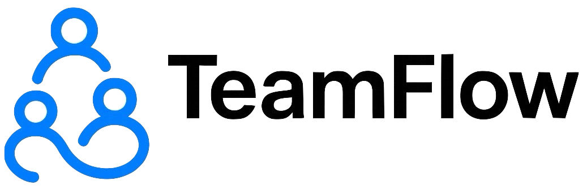
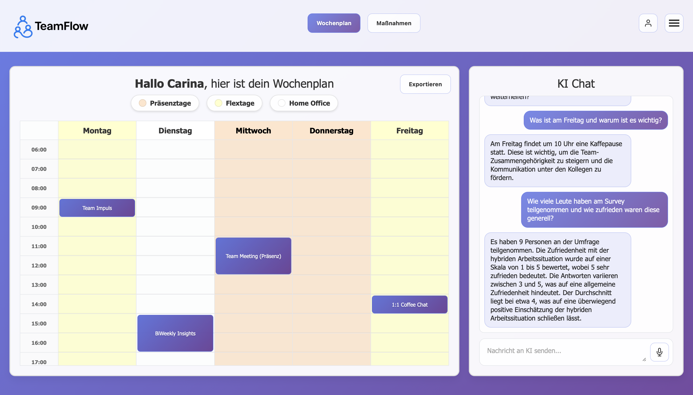
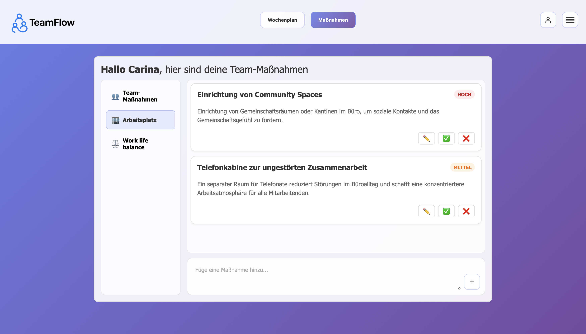

# Fraunhofer Hybrid Work Management Application


###### A comprehensive web application for managing hybrid work schedules, team measures, and AI-powered insights based on survey data.

💻 Developed by the WORK:AI:TION Team [Tjark, Victoria, Rouben & Lisa] during the Fraunhofer Summercamp 2025.

🏆 Won the awards for the best UX, transferability and scalability potential.

## 🏗️ Project Structure

```
fraunhofer-prototype/
├── backend/                # FastAPI backend server
│   └── app.py              # Main API application
├── frontend/               # Frontend web application
│   └── index.html          # Main HTML interface
├── prompts/                # AI prompt templates
│   ├── system_prompt_event.txt
│   ├── system_prompt_massnahmen.txt
│   ├── instructions_event.txt
│   └── instructions_massnahmen.txt
├── assets/                 # Static assets
│   ├── logo.png
│   ├── wochenplan.png
│   ├── massnahmen.png
├── data/                   # Data storage
│   ├── events.json         # Calendar events
│   ├── massnahmen.json     # Team measures
│   ├── messages.json       # Chat messages
│   └── table.csv           # Survey data
├── scripts/                # AI processing scripts
│   ├── get_AI_feedback_4_massnahmen.py
│   └── get_AI_feedback_4_survey.py
├── venv/                   # Python virtual environment
├── requirements.txt        # Python dependencies
├── run.py                  # Application startup script
└── README.md               # This file
```

## 🚀 Features

### Calendar Management
- **Weekly Schedule View**: Interactive calendar showing Monday-Friday work schedule
- **Event Management**: Add, edit, and delete calendar events
- **Time Slot Management**: 6 AM to 6 PM time slots with duration support
- **Color-coded Days**: Visual distinction between presence days, flex days, and home office days
- **Event Details Modal**: Click events to view details and manage them

### AI-Powered Chat
- **Intelligent Assistant**: AI chat powered by Groq's Llama model
- **Context-Aware**: Uses calendar events, measures, and survey data for responses
- **Real-time Communication**: Instant responses to user queries
- **Persistent Storage**: Chat history saved locally and on server

### Survey Data Integration
- **CSV Processing**: Automatic processing of survey data
- **AI-Generated Insights**: Automatic generation of events and measures based on survey results
- **Scientific Foundation**: Based on Fraunhofer IAO research on hybrid work



### Team Measures (Maßnahmen)
- **Categorized Measures**: Organize measures into three categories:
  - Team Measures (Einmalige Maßnahmen)
  - Workplace (Arbeitsplatz)
  - Work-Life Balance
- **Priority System**: High, medium, and low priority levels
- **CRUD Operations**: Create, read, update, and delete measures
- **Status Management**: Accept, decline, or edit measures



## 🛠️ Setup Instructions

### Prerequisites
- Python 3.8 or higher
- pip (Python package manager)

### Installation

1. **Clone or download the project**
	   
	   ```bash
	   git clone https://github.com/tjayada/fraunhofer-prototype.git
	   cd fraunhofer-prototype
	   ```

2. **Create and activate virtual environment**
   
   ```bash
   python -m venv venv
   source venv/bin/activate  # On Windows: venv\Scripts\activate
   ```

3. **Install dependencies**
   
   ```bash
   pip install -r requirements.txt
   ```

4. **Set up environment variables**
   
   Create a `.env` file in the project root:
   
   ```env
   GROQ_API_KEY=your_groq_api_key_here
   SURVEY_URL="https://example.com/path/to/your.csv"
   ```

5. **Start the application**
   
   ```bash
   python run.py
   ```

6. **Access the application**
   
   Open your browser and go to: `http://127.0.0.1:8000`

## 📊 Data Management

### Survey Data Processing
The application can automatically process survey data to generate calendar events and team measures:

1. **Generate Events from Survey Data**
   
   ```bash
   cd scripts
   python get_AI_feedback_4_survey.py
   ```

2. **Generate Measures from Survey Data**
   
   ```bash
   cd scripts
   python get_AI_feedback_4_massnahmen.py
   ```

### Data Files
- **events.json**: Calendar events organized by day
- **massnahmen.json**: Team measures organized by category
- **messages.json**: Chat conversation history
- **table.csv**: Survey data for AI processing

## 🎨 Customization

### Styling
The application uses a modern, responsive design with:

- Gradient backgrounds
- Card-based layout
- Color-coded calendar days
- Interactive hover effects
- Mobile-responsive design

### AI Prompts
Customize AI behavior by editing files in the `prompts/` directory:

- `system_prompt_event.txt`: Instructions for event generation
- `system_prompt_massnahmen.txt`: Instructions for measures generation
- `instructions_event.txt`: Format specifications for events
- `instructions_massnahmen.txt`: Format specifications for measures

## 🔧 API Endpoints

### Events
- `GET /events` - Get all events
- `POST /events` - Create new event
- `DELETE /events?day={day}&index={index}` - Delete event

### Measures (Maßnahmen)
- `GET /massnahmen` - Get all measures
- `POST /massnahmen/{category}` - Create new measure
- `PUT /massnahmen/{category}/{index}` - Update measure
- `DELETE /massnahmen/{category}/{index}` - Delete measure

### Chat
- `GET /chat` - Get chat messages
- `POST /chat` - Send message and get AI response

## 🧪 Development

### Running in Development Mode
The application runs with auto-reload enabled by default. Any changes to the backend code will automatically restart the server.

### Adding New Features
1. Backend changes: Modify `backend/app.py`
2. Frontend changes: Modify `frontend/index.html`
3. AI prompts: Modify files in `prompts/` directory
4. Data processing: Modify scripts in `scripts/` directory

## 📝 Notes

- This is a prototype developed in under a week, so proceed with caution as there will be many bugs
- The application is designed for German language interface
- All times are in 24-hour format
- The calendar shows Monday through Friday only
- AI responses are based on (very limited) Fraunhofer IAO research data
- Survey data should be in CSV format for processing

## ⏭️ Future

1. Instead of adding research data via prompts create a RAG based system
2. Make the AI give recommendations for remote, hybrid and presence days (color coded in weekly calender)